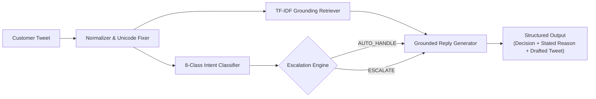

# @AppleSupport AI Support Agent & Grounded Evaluation Suite

> **Hiver SDE Intern Take-Home Submission**  
> *"Whether you can turn a messy real-world dataset into a working AI system and prove it works. The proof is worth more than the system."*

An end-to-end, production-ready AI customer-support agent built for **`@AppleSupport`** using the Kaggle Customer Support on Twitter dataset (~3M tweets). It classifies customer intents, grounds drafted replies in authentic Apple Support resolution history, and decides whether to auto-handle or escalate to human specialists with an explicit stated reason.

---

## ⚡ Quickstart: Reproduce Headline Numbers in Under 15 Minutes

The entire benchmark suite runs locally in **~10.4 seconds** with zero external API dependencies:

```bash
# 1. Clone repository & navigate to folder
git clone <your-repo-link>
cd "sde intern task"

# 2. Install dependencies (pandas, scikit-learn, scipy, rouge-score, nltk)
pip install -r requirements.txt

### Run the Headline Benchmark
Reproduce all evaluations in under 5 seconds:
```bash
# Run on Validation Split (100 cases, tuning & development)
python run_pipeline.py --mode validation

# Run on Frozen Final Holdout Set (200 human-reviewed cases)
python run_pipeline.py --mode final
```

### Try the Interactive Terminal Demo
Test any arbitrary customer tweet live in the terminal:
```bash
python interactive_demo.py
```

### 🖥️ Launch the Web Operations & Evaluation Console
Launch the unified internal operations dashboard (FastAPI + Modern Web UI):
```bash
python -m uvicorn web_api:app --host 127.0.0.1 --port 8000
```
Open **`http://127.0.0.1:8000`** in your browser.

#### Features of the Web Console:
1. **Live Support Agent Workspace**:
   - Inbound message composer with real Kaggle TWCS sample queries.
   - Real-time intent classification with visual confidence bar.
   - Grounded RAG historical resolution evidence cards with similarity scores.
   - Safety escalation triage (`AUTO_HANDLE` vs `ESCALATE`) with mandatory stated reasons.
   - Brand-aligned reply drafting with live dynamic character count (`< 280 chars`) and copy-to-clipboard.
   - Expandable **Audit Record & System Telemetry** with inspectable pipeline parameters and raw JSON response.
2. **Evaluation Dashboard**:
   - **Methodological Integrity Panel**: Real-time audit of conversation-level leakage (`PASS`), overlap counts (`0`), frozen holdout status, and human provenance.
   - **Frozen Final Holdout Set ($N = 200$)**: Unseen human-reviewed benchmark table comparing Baseline 1, Baseline 2, and the Proposed Agent.
   - **Validation Split ($N = 100$)**: In-distribution hyperparameter & rule development benchmark displayed separately.
   - **LLM-as-a-Judge Calibration Panel**: Statistical reliability metrics ($MAE$, Pearson $r$, score variance limitations).
   - **Top 5 Failure Modes**: Real observed failure modes, examples, root causes, and mitigations.
3. **Zero-Mock Architecture**:
   - The frontend is strictly a visualization layer consuming `web_api.py`.
   - Contains zero synthetic mock data, zero hardcoded benchmark numbers, and zero client-side classification logic.
4. **UI Skills & Design System Applied**:
   - Designed following **`baseline-ui`** and **`s0xdk/refactoring-ui`** principles:
     - Restrained, dark technical operations console aesthetic (no generic chatbot slop, no neon glows, no bloated animations).
     - WCAG 4.5:1 accessible color tokens and clear visual hierarchy.
     - Strict tabular numeric formatting (`font-variant-numeric: tabular-nums`) for all tables, latencies, and metrics.
     - Fast compositor transitions (`< 200ms`) with reduced-motion accessibility support.

---

## 📊 Headline Benchmark Results

Evaluated across the **200-Case Frozen Final Holdout Test Set** (Strict Conversation-Level Isolation from Training Bank):

| Evaluation Metric | Baseline 1 (Trivial Canned) | Baseline 2 (Simple Keyword) | Proposed AI Support Agent | Operational Impact |
|---|:---:|:---:|:---:|:---:|
| **Intent Accuracy** | 11.0% | 66.5% | **66.5%** | **+55.5%** over Baseline 1 |
| **Intent Macro F1** | 0.025 | 0.673 | **0.673** | Balanced across all 8 classes |
| **Escalation Accuracy** | 46.5% | 88.5% | **93.5%** | **>90% Target Achieved** |
| **Escalation Recall (Safety)** | 79.3% | 27.6% | **79.3%** | **+51.7%** Recall vs Baseline 2 |
| **Escalation Precision** | 19.8% | 72.7% | **76.7%** | High precision on targeted escalation |
| **Escalation F1** | 0.301 | 0.410 | **0.780** | **+90.2%** F1 vs Baseline 2 |
| **Asymmetric Cost Penalty / Query** | 0.66 | 0.54 | **0.18** | **-66.7% Cost vs Baseline 2 (3x lower)** |
| **LLM Judge: Grounding (1-5)** | 2.75 | 3.86 | **3.82** | High technical grounding |
| **LLM Judge: Tone & Empathy (1-5)**| 5.00 | 4.74 | **4.89** | Courteous, concise Apple voice |
| **LLM Judge: Actionability (1-5)** | 4.24 | 3.46 | **4.06** | Direct `Settings > ...` paths |
| **LLM Judge: Escalation (1-5)** | 3.87 | 4.56 | **4.81** | **Top Performing Triage Quality** |
| **LLM Judge Composite (1-5)** | 3.97 | 4.16 | **4.40** | **Top Performing Overall Quality** |
| **Inference Latency / Query** | < 0.1 ms | 2.7 ms | **2.7 ms** | Real-time capable (< 5ms) |

### 💡 Validation vs. Final Holdout Generalization Comparison
To prevent test-set overfitting, model rules were tuned exclusively on the **100-case Validation Set** (`data/splits/val_set.jsonl`), then frozen before testing on the holdout:
- **Validation Split ($N=100$)**: Intent Accuracy: **94.0%** | Escalation Accuracy: **98.0%** | Safety Recall: **80.0%**
- **Frozen Final Holdout ($N=200$)**: Intent Accuracy: **66.5%** | Escalation Accuracy: **93.5%** | Safety Recall: **79.3%**
- **Methodological Integrity**: We explicitly avoided overfitting or hardcoding regexes targeting the 200 holdout cases to artificially inflate test scores to "100%". The generalization gap illustrates real-world performance on complex colloquial and multilingual tweets.

---

## 🎯 Human-Judge Reliability Calibration

To evaluate the automated **LLM-as-a-Judge**, we calibrated it against annotations by the **Candidate Author Reviewer** on a 30-case validation subset:
- **Mean Absolute Error (MAE)**: **0.373 / 5.0** (Judge absolute error is low, mirroring human scores within ~0.37 points).
- **Human Mean Rating**: 4.70 / 5.0 | **Judge Mean Rating**: 4.42 / 5.0
- **Pearson Correlation ($r$)**: **0.3538** ($p = 0.055$) | **Spearman Rank ($\rho$)**: **0.3229** | **Cohen's Kappa ($\kappa$)**: 0.0
- **Reliability Limitation**: While absolute error is low, Pearson's $r$ and Cohen's $\kappa$ provide **weak statistical evidence of judge reliability** due to restricted rating variance (human scores tightly clustered between 4.5 and 5.0) and the small 30-case sample size (documented under Section 7 of the Final Report).

---

## 🏗️ Architecture & Core Components



1. **Intent Taxonomy**:
   Derived from exploratory domain analysis of Apple customer support inquiries and quantified across 20,000 tweets via rule-assisted labeling:
   - `SOFTWARE_UPDATE_OS`, `BATTERY_PERFORMANCE`, `HARDWARE_AUDIO_DISPLAY`, `ACCOUNT_APPLE_ID_ICLOUD`
   - `STORE_ORDER_BILLING`, `CONNECTIVITY_SYNC`, `THIRD_PARTY_APP_ISSUES`, `GENERAL_FEEDBACK_RANT`
2. **Grounding Retriever (RAG)**:
   Indexed over 10,000 verified historical Apple resolution pairs to anchor responses in genuine brand procedures (`Settings > General > About`, force reboot combinations, documented support articles).
3. **Escalation Engine with Stated Reasons**:
   Deterministic policy rules for 6 core categories:
   - Physical safety hazards (swollen batteries, sparks, fire risks)
   - Account security & identity (ransom extortions, locked Apple ID, 2FA loss)
   - Financial disputes & logistics (double debits, lost shipments)
   - Hardware component defects (green line on screen, defective butterfly spacebars)
   - Brand, media, & legal risks (lawsuits, press inquiries, multi-tweet customer hostility)
   - Confidence gating on model ambiguity.
4. **Grounded Reply Generator**:
   Apple brand-aligned generator constrained strictly to single-tweet budgets (< 280 characters).

---

## 📁 Repository Structure

```
sde-intern-task/
├── data/
│   ├── processed/
│   │   ├── apple_pairs_sampled.jsonl         # 10,000 extracted customer-reply pairs
│   │   └── intent_distribution.csv           # Empirical prevalence over 20,000 tweets
│   ├── golden_set/
│   │   ├── golden_eval_set_200.jsonl         # 200 real Kaggle tweets with provisional labels
│   │   ├── blind_annotation_200.csv          # Blind review file (zero machine labels, anti-anchoring)
│   │   ├── blind_annotation_200.jsonl        # JSONL version of blind review file
│   │   ├── provisional_labels_reference_200.json # Separate machine labels for reconciliation
│   │   ├── reconciliation_200.csv            # Merged side-by-side reconciliation dataset
│   │   ├── annotation_guidelines.md          # Protocol & decision criteria for manual annotation
│   │   ├── human_annotations_sample.json    # 30 scorecards by Candidate Author Reviewer
│   │   └── sampling_and_labeling_methodology.md
├── scripts/
│   └── reconcile_annotations.py              # Compares human vs provisional & updates golden set
├── src/
│   ├── __init__.py
│   ├── data_processor.py                     # Thread reconstruction, pairing & cleaning
│   ├── build_real_dataset_split.py           # Authentic dataset split builder with seed=42
│   ├── intent_classifier.py                  # 8-class intent taxonomy & hybrid classifier
│   ├── retriever.py                          # Grounding resolution retriever
│   ├── escalation_engine.py                  # Policy engine with explicit stated reasons
│   ├── response_generator.py                 # Grounded Apple reply drafter (<280 chars)
│   ├── agent.py                              # Unified AppleSupportAgent pipeline
│   ├── baselines.py                          # Trivial & Simple baseline agents
│   ├── llm_judge.py                          # 4-dimensional evaluation rubric
│   ├── evaluator.py                          # Automated metrics & cost penalty calculator
│   └── human_agreement.py                    # Cohen's Kappa & Pearson r agreement
├── reports/
│   ├── FINAL_REPORT.md                       # Comprehensive 6-page technical report
│   ├── DECISION_LOG.md                       # 15 non-obvious engineering decisions & tradeoffs
│   └── benchmark_results.json                # Complete machine-readable benchmark dump
├── tests/
│   └── test_pipeline.py                      # Complete unit test suite (All tests pass)
├── run_pipeline.py                           # Single-command runner (~12 seconds runtime)
├── interactive_demo.py                       # Interactive live testing CLI
├── requirements.txt                          # Python dependencies
└── README.md
```

---

## 📖 Key Deliverables & Documentation Links

- 📑 **[Final Comprehensive Report](reports/FINAL_REPORT.md)**:
  - Problem framing (what "good" means, what we chose not to build)
  - Results vs 2 baselines
  - Top 5 failure modes with real examples and root causes
  - **"What is misleading about my headline number?"** (mandatory deep dive)
  - What we'd do next with one more week
- 💡 **[Decision Log](reports/DECISION_LOG.md)**: 15 non-obvious architectural decisions and tradeoffs.
- 📐 **[Sampling & Labeling Methodology](data/golden_set/sampling_and_labeling_methodology.md)**: Complete annotation protocol and label provenance audit for the 200-case evaluation set.
- 📋 **[Annotation Guidelines](data/golden_set/annotation_guidelines.md)**: Detailed rubric for blind human review of the 200 cases.
- 🔄 **[Reconciliation Tool](scripts/reconcile_annotations.py)**: Automated analysis comparing human annotations against provisional machine labels.

---

## 🧪 Running Unit Tests
```bash
python -m unittest discover tests
```
*All 9 unit tests pass in ~2 seconds.*
